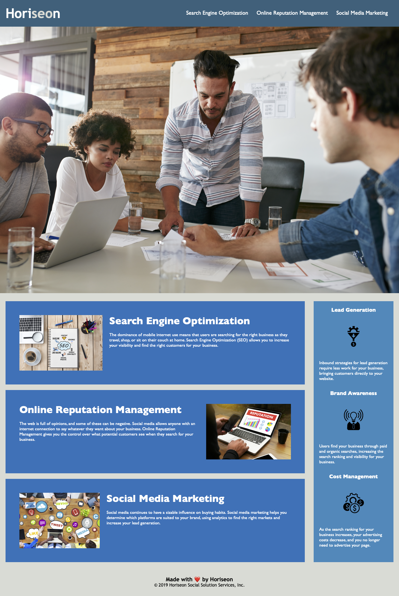

# 02-Challenge - Refactoring HTML and CSS

## Overview

### The goal of this project was twofold:

- Refactor the extisting code to utilize semantic structure
- Provide accessibility to users with
  disabilities

This project provided me with insight about users with disabilities that I had previously never considered. How do people that are blind, deaf, or both access the internet? The answer is accessibility functions and it has become clear that it is critical consider these users when developing projects.

## Table of Contents (Optional)

If your README is long, add a table of contents to make it easy for users to find what they need.

- [Description](#Description)
- [Technology](#Technology)
- [License](#license)
- [Badges](#badges)

## Description

Link to the deployed website: https://cascadecolin.github.io/Week1Refactoring/

This image depicts the live website: 

### Refactoring

[Accessibility](#Accessibility) features were implemented while the refactoring was being completed in the name of efficiency. HTML and CSS code has been improved utilizing best practices for semantic structure. There was redundant code present in CSS that was removed entirely. The remaining CSS elements were consolidated into a single structure. This had the added benefit of cleaning up the HTML code by removing `id` and `class` selectors that were not necessary. All `
` elements were altered to be `<section>`, `<article>`, or `` elements, all of which were wrapped into a `<main>` element. The main background image, located under the header, was changed to be an `` element so that an `alt` attribute could be added for [Accessibility](#Accessibility). The existing CSS element was also changed to an `id` rather than a `class` due to it only being used once by the webpage. Lastly, the CSS elements that were previously consolidated were renamed in order to make them more intuitive for any future developer. Comments were also added to further this goal.

### Accessibility

First, HTML `alt=""` attributes were added to existing `` elements. This provides users with vision impairments to understand the context of images. Second, WAI-ARIA accessibility features were added to provide context for screen readers. For example, there is a heart emoji in the footer of the webpage. The context of this is to inform the user that the website is "made with love" by Horiseon. However, the default Windows 10 screen reader Navigator reads this page as "Made with red heart by Horiseon". It's hard to say this is made with love when someone that is visually impaired cannot even properly comprehend this line! Therefore, WAI-ARIA features were used to apply context to the webpage.

## Technology

Microsoft's VS Code was the programming platform used to refactor the code and add accessibility features. Testing for accessibility for screen readers was done using Navigator, the built-in screen reader for Windows 10. A GitHub repository was utilized for version control, as well as provide a streamlined deployment to GitHub Pages. The original code was provided via a GitLab repository.

## License

MIT License

Copyright (c) 2022 CascadeColin

Permission is hereby granted, free of charge, to any person obtaining a copy
of this software and associated documentation files (the "Software"), to deal in the Software without restriction, including without limitation the rights to use, copy, modify, merge, publish, distribute, sublicense, and/or sell copies of the Software, and to permit persons to whom the Software is furnished to do so, subject to the following conditions:

The above copyright notice and this permission notice shall be included in all copies or substantial portions of the Software.

THE SOFTWARE IS PROVIDED "AS IS", WITHOUT WARRANTY OF ANY KIND, EXPRESS OR IMPLIED, INCLUDING BUT NOT LIMITED TO THE WARRANTIES OF MERCHANTABILITY, FITNESS FOR A PARTICULAR PURPOSE AND NONINFRINGEMENT. IN NO EVENT SHALL THE AUTHORS OR COPYRIGHT HOLDERS BE LIABLE FOR ANY CLAIM, DAMAGES OR OTHER LIABILITY, WHETHER IN AN ACTION OF CONTRACT, TORT OR OTHERWISE, ARISING FROM, OUT OF OR IN CONNECTION WITH THE SOFTWARE OR THE USE OR OTHER DEALINGS IN THE SOFTWARE.

## Badges

